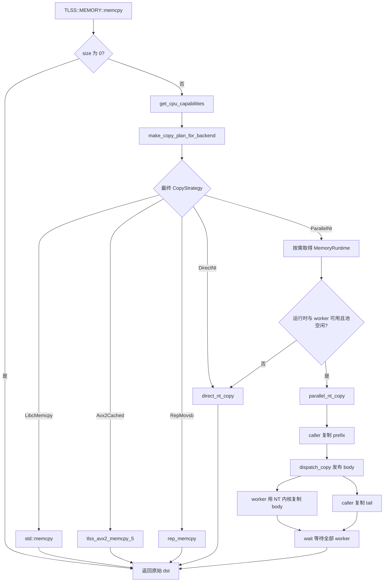
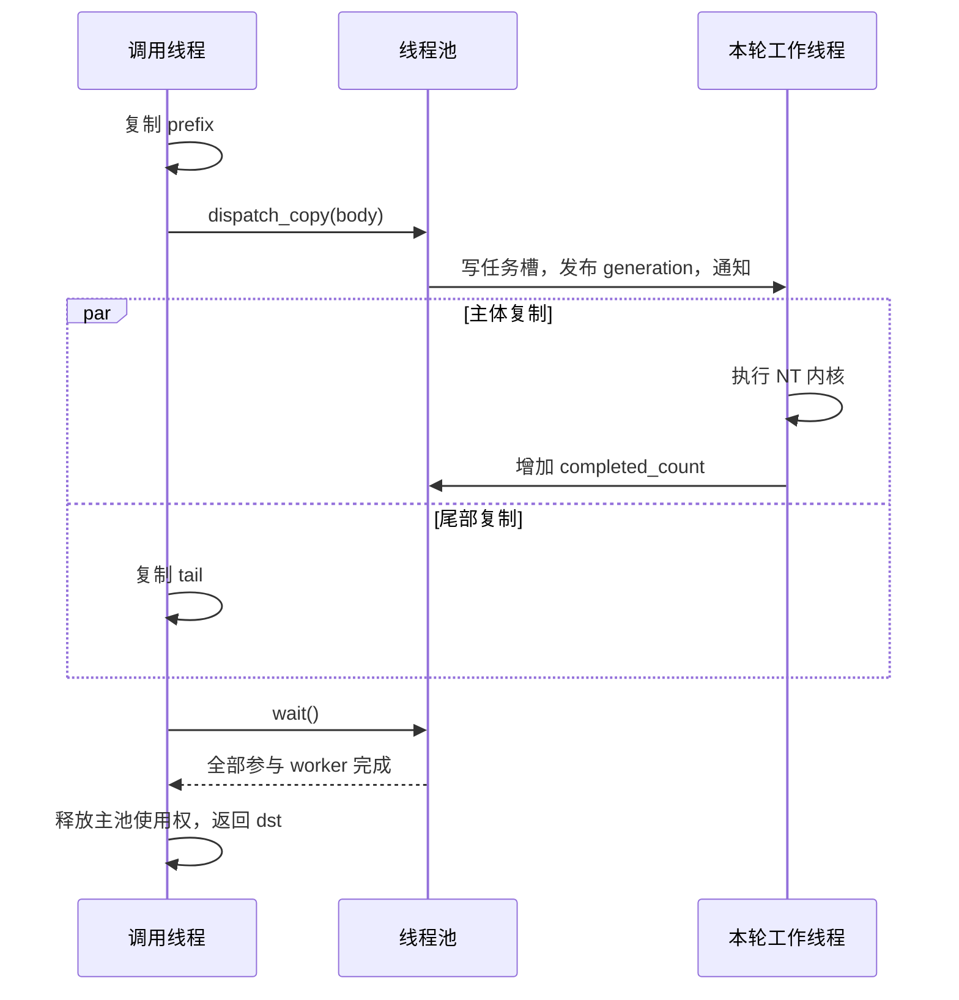

# memory 模块源码导读

基于当前工作区，源码版本 `757ee99`，阅读日期 2026-10-06。核对时 `src/common/memory` 与 `inc/common/memory` 没有相对 HEAD 的源码改动；仓库其他模块存在本地改动。

本文覆盖本模块全部 C++ 函数、头文件内联方法、测试钩子，以及三个汇编入口和内部标签的职责。测试与 benchmark 仅作为阅读证据，本次没有运行编译、测试或性能测量。性能设计意图与实测收益分别说明。

学习前需要了解：指针与字节偏移、C++ RAII、线程与互斥锁、条件变量、原子变量的 release/acquire，以及基本 x86 寄存器。所有路径以仓库根目录为基准；正文链接相对于本文所在目录。

## 模块全貌与阅读顺序

模块对外提供 `TLSS::MEMORY::memcpy`，负责将 `src` 的 `size` 个字节复制到 `dst`，返回原始 `dst`。内部按数据大小、使用提示和 CPU 能力选择实现，必要时使用固定工作线程并行复制。

| 层次 | 文件 | 解决的问题 |
| --- | --- | --- |
| 公开接口 | `inc/common/memory/tlss_memcpy.h`、`src/common/memory/memcpy_dispatch.cpp` | 接收请求、生成计划、按需取得运行时 |
| 策略与能力适配 | `internal/copy_policy.cpp`、`internal/copy_capability_policy.cpp` | 用哪种复制方式、期望多少 worker、硬件是否允许 |
| 执行分派 | `internal/copy_executor.cpp` | 将策略映射到具体函数 |
| 单线程与并行包装 | `internal/direct_nt_copy.cpp`、`internal/parallel_nt_copy.cpp`、`internal/copy_partition.cpp` | 将任意长度和对齐的请求转成内核可接受的块 |
| 运行时调度 | `internal/memory_runtime.cpp`、`internal/parallel_copy_pool.cpp` | 持有线程、选择参与者、发布任务并等待完成 |
| CPU 发现 | `internal/cpu_capabilities.cpp`、`internal/cpu_affinity.cpp`、`internal/cpu_core_type.cpp`、`internal/cpu_topology.cpp`、`internal/worker_selection.cpp` | 指令是否可用、哪些 CPU 可用、如何挑选物理核心 |
| 搬运内核 | `avx2_memcpy_v6.asm`、`rep_memcpy.asm`、`tlss_avx2_nt_memcpy_2stream.asm` | 实际执行加载和存储 |

上表省略前缀的 `internal/` 和汇编文件都位于 `src/common/memory/`。对应头文件位于 `inc/common/memory/internal/`。



`CMakeLists.txt` 将上述源码构建为共享库 `tlss_memory`，输出到项目 `lib/`。`src/common/CMakeLists.txt` 通过 `common_lib PUBLIC tlss_memory` 传递链接依赖。当前搜索到的外部显式调用主要在测试和 benchmark；命名空间中的函数不会自动替换其他代码的 `std::memcpy`。

课程按调用依赖排列，全部已展开：

1. 一次公开调用如何决定复制方式。
2. 第一次并行请求如何准备 CPU 和线程。
3. 任意内存区间如何拆成头、主体和尾部。
4. 工作线程如何收任务，调用线程如何等待结果。
5. 汇编内核如何搬运字节。
6. 用完整实例串联退化、生命周期与验证边界。

## 第 1 课：公开接口与复制策略〔已展开〕

目标：解释相同长度的数据为什么会走不同路径，以及默认调用是否会启动线程。

主链：`memcpy → get_cpu_capabilities → make_copy_plan_for_backend → 按需取得 runtime → execute_copy_plan → 返回 dst`。

必读顺序：

1. [tlss_memcpy.h](../../../inc/common/memory/tlss_memcpy.h)：输入参数、两个枚举、两个重载。
2. [memcpy_dispatch.cpp](memcpy_dispatch.cpp)：公开入口如何连接策略、运行时和执行器。
3. [copy_policy.cpp](internal/copy_policy.cpp)：大小与提示如何转成 `CopyPlan`。
4. [copy_capability_policy.cpp](internal/copy_capability_policy.cpp)：检查能力并形成最终计划。
5. [copy_executor.cpp](internal/copy_executor.cpp)：计划如何落到函数调用。

CPU 探测细节留到第 2 课，汇编细节留到第 5 课。可选验证证据为 `src/common/benchmark/benchmark_1.cpp` 中的 `run_copy_policy_test` 和 `run_backend_plan_contract_test`。

### 1.1 公开契约和核心数据

```cpp
void* memcpy(void* dst, const void* src, std::size_t size);
void* memcpy(void* dst, const void* src, std::size_t size,
             CopyBackend backend, CopyHint hint);
```

`CopyBackend` 是调用者选择的方式：`Auto`、`Avx2`、`RepMovsb`、`NonTemporal`。

`CopyHint` 描述用途：`Default` 为默认策略，`Streaming` 用于流式搬运的策略选择。它不是异步开关，两种提示下函数都同步返回。

内部 `CopyStrategy` 比公开 backend 更细：`LibcMemcpy`、`Avx2Cached`、`RepMovsb`、`DirectNt`、`ParallelNt`。`CopyPlan` 将 `strategy` 与 `worker_count` 放在一起；worker 数在并行策略中表示期望参与的后台线程数，后续还会根据可用核心缩减。

调用者应提供有效的、容量足够的、不重叠的源与目标区域。这里具有 memcpy 语义，不提供 memmove 的重叠处理。复制字节不会替调用者管理对象构造、析构或缓冲区容量。

`size == 0` 直接返回原始 `dst`，发生在 CPU 探测、backend 校验和 runtime 初始化之前。非零调用没有统一的公开指针合法性检查，不能把内部某个函数的参数检查理解成整个 API 的保证。

### 1.2 memcpy_dispatch.cpp 中的每个函数

| 函数 | 输入与行为 | 输出及意义 |
| --- | --- | --- |
| `memcpy(dst, src, size)` | 把请求转交五参数重载，指定 `Auto + Default` | 提供普通调用入口 |
| `memcpy(dst, src, size, backend, hint)` | 零长度早退；取得 CPU 能力；生成计划；仅在计划为 `ParallelNt` 时请求 runtime；调用执行器 | 返回原始目标指针；不支持的显式 backend 可以抛异常 |
| `get_memory_runtime()` | 首次进入时执行函数局部静态指针的 `new MemoryRuntime()` | 返回共享运行时引用；局部静态初始化具有线程安全性，构造抛异常后允许后续重试 |
| `try_get_memory_runtime()` | 调用上一个函数，捕获全部异常 | 成功返回指针，失败返回 `nullptr`，使当前请求可以退回单线程 |

局部静态对象是“指针”，指向的 runtime 没有被 `delete`。源码注释明确说明这样做是为了让其他静态对象在析构阶段仍能调用本模块，具体生命周期见第 6 课。

### 1.3 select_copy_plan：只做策略判断

位置：[copy_policy.cpp](internal/copy_policy.cpp)。该函数只使用 `size` 和 `hint`，不查询硬件、不创建线程、不复制数据。

以下表格是 `Auto` 在能力适配之前的计划；`1 KiB = 1024 B`，零长度由公开入口提前处理。

| 大小 | `Default` | `Streaming` |
| --- | --- | --- |
| `1～2048 B` | `Avx2Cached` | `Avx2Cached` |
| `2049～3071 B` | `RepMovsb` | `LibcMemcpy` |
| `3072～8191 B` | `RepMovsb` | `Avx2Cached` |
| `8192～65535 B` | `RepMovsb` | `DirectNt` |
| `65536～131071 B` | `RepMovsb` | `ParallelNt`，期望 4 workers |
| `>= 131072 B` | `RepMovsb` | `ParallelNt`，期望 8 workers |

由此可以直接看出：三参数默认调用即使复制 1 GiB，也选择 `RepMovsb`，不会因数据变大而开启线程池。

2049～3071 B 的 libc 区间、其后又回到 AVX2 的区间，是当前实现中的固定阈值。源码能证明这些选择存在，但单靠阈值不能证明它们在所有 CPU 和工作负载上最快。策略函数也不根据 `erms` 动态调参。

### 1.4 copy_capability_policy.cpp 中的每个函数

| 函数 | 工作内容 | 关键分支 |
| --- | --- | --- |
| `adapt_auto_plan_for_capabilities(plan, capabilities)` | 给 Auto 选出的计划做能力校验 | libc/REP 原样保留；AVX2/单线程 NT/并行 NT 在 `avx2_usable == false` 时改成 libc、1 worker；无效策略也退回 libc |
| `select_safe_auto_copy_plan(size, hint, capabilities)` | 先 `select_copy_plan`，再调用上述能力适配 | 将“策略偏好”和“能否执行”分开 |
| `is_backend_supported(backend, capabilities)` | 判断公开 backend 是否被当前实现接受 | Auto、REP 为真；AVX2、NT 依赖 `avx2_usable`；未知 backend 为假 |
| `make_copy_plan_for_backend(size, hint, backend, capabilities)` | 统一处理自动选择和显式选择 | Auto 走安全自动策略；显式 AVX2/NT 不支持时抛 `runtime_error`；未知 backend 抛异常 |

显式 backend 的最终策略如下，`hint` 不再改变选择：

| 显式 backend | 最终策略 | 会创建线程池吗 |
| --- | --- | --- |
| `Avx2` | `Avx2Cached` | 不会 |
| `RepMovsb` | `RepMovsb` | 不会 |
| `NonTemporal` | `DirectNt` | 不会 |

因此 `NonTemporal + Streaming` 仍然是单线程包装路径。NT 包装内部还可能因数据不够组成完整块而使用 cached AVX2。

### 1.5 execute_copy_plan：集中执行

位置：[copy_executor.cpp](internal/copy_executor.cpp)。它接收最终 `CopyPlan`、可空 runtime、源目标和长度，按策略分派：

| 策略 | 实际调用 |
| --- | --- |
| `LibcMemcpy` | `std::memcpy` |
| `Avx2Cached` | `tlss_avx2_memcpy_5` |
| `RepMovsb` | `rep_memcpy` |
| `DirectNt` | `direct_nt_copy` |
| `ParallelNt` 且 runtime 非空 | `MemoryRuntime::execute_parallel_copy` |
| `ParallelNt` 且 runtime 为空 | `direct_nt_copy` |

遇到无效内部策略抛 `logic_error`。执行器本身不重新校验 CPU 能力，直接调用内部接口的代码必须满足前置条件。

## 第 2 课：CPU 探测和并行运行时〔已展开〕

目标：解释“机器支持 AVX2”和“本模块能使用并行 NT”为什么是两个独立条件。

主链：`首次 ParallelNt 请求 → MemoryRuntime 构造 → affinity → topology → IntelCore 列表 → 主池 → 按 caller CPU 预计算 worker 表`。

必读顺序：

1. [cpu_capabilities.cpp](internal/cpu_capabilities.cpp)：指令可用性。
2. [cpu_affinity.cpp](internal/cpu_affinity.cpp)：调用线程允许使用的 CPU。
3. [cpu_topology.cpp](internal/cpu_topology.cpp) 与 [cpu_core_type.cpp](internal/cpu_core_type.cpp)：逻辑 CPU、物理核和核类型。
4. [worker_selection.cpp](internal/worker_selection.cpp)：将候选 CPU 转成线程池索引。
5. [memory_runtime.cpp](internal/memory_runtime.cpp)：连接探测结果与常驻线程。

线程池内部实现留到第 4 课。可选证据：`benchmark_1.cpp` 中的 `run_worker_selection_test`、`run_master_worker_selection_test`、`run_lazy_runtime_test`、`run_concurrent_first_use_test`。

### 2.1 cpu_capabilities.cpp 的三个函数

`read_xcr0()` 用 `xgetbv` 读取 XCR0，并组合 EDX/EAX 成 64 位值。它是本文件内部辅助函数，只在满足 AVX 硬件与 OSXSAVE 条件后调用。

`detect_cpu_capabilities()` 返回一个 `CpuCapabilities`：

1. CPUID leaf 1 检查硬件 AVX 和 OSXSAVE。
2. 两者都满足时，读取 XCR0，检查 XMM 与 YMM 状态位均启用，得到 `avx_usable`。
3. 若支持 CPUID leaf 7，检查 AVX2、ERMS 位。
4. 计算 `avx2_usable = avx2_hardware && avx_usable`。
5. 非 x86 编译分支保留各字段默认 false；这不代表整个模块能跨平台构建，其他源码和汇编仍依赖 Linux/x86-64。

`get_cpu_capabilities()` 用函数局部 `static const` 缓存探测结果并返回引用。普通复制不会每次执行 CPUID。

`erms` 表示增强 REP MOVSB/STOSB 能力，当前已探测但没有参与策略分派；没有 ERMS 不等于不能执行基本的 `rep movsb`。

### 2.2 detect_available_cpu_ids：读取可用 CPU 集合

位置：[cpu_affinity.cpp](internal/cpu_affinity.cpp)。调用 `sched_getaffinity(0, ...)`，遍历 `CPU_SETSIZE` 范围内的置位项，返回 CPU 编号数组。读取失败、空集合或不支持的平台会抛异常。

这里的 `0` 指当前调用线程，因此结果是“首次初始化 runtime 的那个线程当时的 affinity”。这个语义见 [Linux sched_getaffinity 手册](https://www.man7.org/linux/man-pages/man2/sched_getaffinity.2.html)。它不等同于整台机器所有在线 CPU，也不代表其他线程的 affinity。

如果首次初始化的线程已被限制在少数 CPU 上，runtime 建立的拓扑和主池也会受到限制。当前实现不会在之后自动刷新这一快照。

### 2.3 cpu_core_type.cpp 的三个函数

| 函数 | 行为 | 结果 |
| --- | --- | --- |
| `detect_current_cpu_core_type()` | 读取当前 CPU 的 CPUID leaf `0x1A`，取 EAX 高 8 位 | `0x40 → IntelCore`；`0x20 → IntelAtom`；不支持或其他值 → `Unknown` |
| `detect_cpu_core_type(cpu_id)` | 检查编号，保存调用线程 affinity，临时绑定目标 CPU，调用上一个函数，再恢复原 affinity | 返回目标 CPU 的类型；失败返回 `Unknown` |
| `cpu_core_type_name(core_type)` | 将枚举转成字符串 | `IntelCore`、`IntelAtom` 或 `Unknown`，用于展示 |

临时绑定是因为 CPUID 描述执行该指令的 CPU。通常可以将这里的 IntelCore/IntelAtom 联系到混合架构中的性能核/能效核，但代码识别的是这些 CPUID 值，不是通过频率猜测核类型。

若恢复 affinity 失败，函数返回 `Unknown`，不会抛异常，也没有再次恢复的补救逻辑。这是当前实现的边界。

### 2.4 cpu_topology.cpp 的四个函数与数据结构

`CpuInfo` 保存逻辑 CPU ID、package ID、core ID、拓扑是否已知等。`PhysicalCore` 保存一个物理核及其可用逻辑 CPU 列表；`CpuTopology` 同时保存逻辑 CPU 和物理核两种视图。

| 函数 | 输入到输出的过程 |
| --- | --- |
| `read_integer_file(path, value)` | 打开 sysfs 文件并读取整数，失败返回 false，成功写入引用参数 |
| `detect_cpu_topology(available_cpu_ids)` | 为每个 CPU 读取 `physical_package_id`、`core_id`；按 `(package_id, core_id)` 合并成物理核；选每核第一个逻辑 CPU 探测核类型；返回完整拓扑 |
| `find_physical_core(topology, cpu_id)` | 在物理核的逻辑 CPU 列表里查找指定 ID，找到返回该核地址，否则返回空指针 |
| `select_worker_candidates(topology, caller_cpu_id)` | 找到 caller 所属物理核并排除它；每个其他物理核仅取第一个可用逻辑 CPU；按 IntelCore、IntelAtom、Unknown 分类 |

为何同时使用 package 与 core：不同 CPU package 中可能出现相同 core ID，组合键才能区分。

为何排除 caller 的整个物理核：即使换用同核的另一个超线程，仍共享物理执行资源。源码通过排除整核避免将它纳入当前任务的后台 worker。

两个实现细节：拓扑读取失败的逻辑 CPU 留在 `cpus`，但不会加入 `physical_cores`；核类型只填在 `PhysicalCore::core_type`，当前没有回填 `CpuInfo::core_type`。

### 2.5 worker_selection.cpp 的三个函数

`select_master_worker_cpu_ids(topology)` 从全部物理核中筛选 `IntelCore`，每核取第一个可用逻辑 CPU。这份列表用于创建主线程池，长度没有硬编码成 4 或 8。

`select_worker_set(candidates, desired_worker_count)` 从 `intel_core_cpu_ids` 前面取 `min(期望数, 可用数)` 个 CPU。期望数为 0 返回空列表。它不会用 IntelAtom 或 Unknown 补足不足的数量。

`select_active_workers(pool_cpu_ids, worker_selection)` 将选中的 CPU ID 映射成池内索引。例如主池 CPU 列表 `[0,2,4,6,8]`，本次选择 `[0,4,8]`，得到索引 `[0,2,4]`。找不到的 CPU 会跳过；调用方在构造计划时检查映射数量是否完整。

CPU ID 与 worker index 是不同的编号空间，理解这一点才能看懂稀疏激活列表。

### 2.6 MemoryRuntime 的构造、查表和执行

| 函数 | 具体职责 |
| --- | --- |
| `MemoryRuntime::MemoryRuntime()` | 检测 affinity 和拓扑，生成主 worker CPU 列表；列表为空时结束构造；否则创建一个 `ParallelCopyPool`，再预计算 worker 计划 |
| `build_runtime_worker_plans()` | 按最大 CPU ID 建立可索引数组；对每个已记录逻辑 CPU，分别挑选期望 4、8 worker 的集合，转成主池索引；完整映射后标记 valid |
| `find_runtime_worker_plan(caller_cpu)` | 对负数、越界、无效槽返回空指针；否则返回已缓存计划的地址；热路径无需重新遍历拓扑 |
| `execute_parallel_copy(desired_worker_count, dst, src, size)` | 取得当前 caller CPU 并查表；检查线程池、目标 worker 数、实际 worker 数及忙标志；能用并行时调用 `parallel_nt_copy`，否则退回 `direct_nt_copy` |
| 局部 `BusyGuard::~BusyGuard()` | 作用域退出时以 release 清除 `master_pool_busy_`，异常退出同样释放占用 |
| `MemoryRuntime::~MemoryRuntime()` | 普通构建默认析构，成员 `unique_ptr` 析构线程池；测试构建先记录析构已开始，再自动析构成员 |

`RuntimeWorkerPlan` 保存 `active_workers_4`、`active_workers_8` 和 `valid`。valid 表示计划能完整映射到池内，并不保证里面有足够 worker，执行阶段还要检查实际数量。

`execute_parallel_copy` 的顺序是：

1. 无主池 → 单线程 NT 包装。
2. `sched_getcpu()` 后查不到 caller 计划 → 单线程 NT 包装。
3. 期望数不是 4 或 8 → 单线程 NT 包装。
4. 实际参与者少于 2 → 单线程 NT 包装。
5. `master_pool_busy_.test_and_set(acquire)` 发现已忙 → 单线程 NT 包装。
6. 获得使用权，创建 `BusyGuard`，执行并行复制并等待完成，退出时释放使用权。

实际线程数可以是 3、5、7 等，不强制等于 4 或 8。假设有 8 个可用 IntelCore 物理核：caller 在其中一个核上时，期望 8 最多得到 7；caller 在其他类型核上时，可能得到 8。

调用期间没有把 caller 固定到 `sched_getcpu()` 读出的 CPU，因此“排除 caller 核”依据的是查表时的位置，之后线程仍可能迁移。worker 自身则在启动时绑定指定 CPU。

## 第 3 课：任意请求如何拆成 NT 块〔已展开〕

目标：解释为什么公开 API 可以接受不对齐指针，而 NT 汇编仍能使用对齐存储。

主链：`direct_nt_copy / parallel_nt_copy → make_copy_partition → prefix + body + tail → 内核与线程池 → 返回 dst`。

必读顺序为 [copy_partition.cpp](internal/copy_partition.cpp)、[direct_nt_copy.cpp](internal/direct_nt_copy.cpp)、[parallel_nt_copy.cpp](internal/parallel_nt_copy.cpp)。可选证据是 `benchmark_1.cpp` 的 `run_copy_partition_test`、`run_parallel_nt_correctness_test`、`run_tlss_memcpy_auto_test`；池内分配留到第 4 课。

### 3.1 make_copy_partition

输入为目标地址、总长度和实际 worker 数，输出 `CopyPartition {prefix_size, body_size, tail_size}`。

```text
dst
 ↓
 [ prefix：0～31 B ][ body：8192 B 的整数倍 ][ tail：剩余字节 ]
                    ↑
                    32 B 对齐
```

算法：

```text
misalignment = dst_address & 31
prefix = misalignment == 0 ? 0 : 32 - misalignment
prefix = min(prefix, size)
remaining = size - prefix
blocks = remaining / 8192

如果 blocks < worker_count：
    body = 0
    tail = remaining
否则：
    body = blocks * 8192
    tail = remaining - body
```

正常有效输入满足 `prefix + body + tail == size`。空目标、零长度或零 worker 返回全零分区，属于此辅助函数自己的约定。

只要求每个 worker 至少有一个完整块，不要求块数能被 worker 数整除。比如 7 个块可以交给 4 个 worker，分成 `2、2、2、1` 块。

目标是 32 B 对齐，不是要求 4 KiB 页对齐。源用非对齐加载，因此不需要为源另外计算 prefix。

### 3.2 direct_nt_copy

函数将通用请求适配到单线程 NT 内核：

1. 零长度返回。
2. 用 `worker_count = 1` 切分。
3. 没有完整 body 时，整个请求交给 cached AVX2。
4. 有 body 时，依次用 cached AVX2 复制 prefix、NT 汇编复制 body、cached AVX2 复制 tail。
5. 返回原始 `dst`。

例如，`size = 8192` 且目标偏离 32 B 边界 13 B，需要 19 B prefix，剩余 8173 B，放不下一个 NT 块，所以整段走 cached AVX2。选择 `DirectNt` 不代表本次必然执行 NT 指令。

### 3.3 parallel_nt_copy

输入除了内存区间，还有池引用和本次激活的 worker 索引列表。

1. 零长度返回。
2. 激活列表为空时，整个请求走 cached AVX2。
3. 按实际 worker 数切分。
4. caller 先用 cached AVX2 复制 prefix。
5. 若有 body，通过 `pool.dispatch_copy` 发布给 worker。
6. caller 用 cached AVX2 复制 tail，此时 worker 可以同时处理 body。
7. caller 执行 `pool.wait()`，确认主体全部完成后返回。
8. 若没有 body，整个请求走 cached AVX2；当前实现可能已经复制过 prefix，因此这里会重复覆盖相同的 prefix 字节。

这条路径只把 body 交给后台 worker。caller 参与 prefix/tail，不作为均分 body 的额外 worker。

即使内部提交是异步的，公开 memcpy 返回时复制已经完成。

## 第 4 课：线程池发布、执行与同步〔已展开〕

目标：解释固定线程池如何创建、绑核和分工，如何保证 worker 看到完整任务，如何避免等待线程错过通知，以及多个调用者如何共享主池。

主链：`池构造 → worker 绑核并报到 → dispatch_copy → generation 发布 → worker_loop → NT 内核 → completed_count → wait 返回`。

必读为 [parallel_copy_pool.h](../../../inc/common/memory/internal/parallel_copy_pool.h) 和 [parallel_copy_pool.cpp](internal/parallel_copy_pool.cpp)。建议顺序：构造 → `dispatch_copy` → `worker_loop` → `wait` → `stop_and_join`。可选证据为 `benchmark_1.cpp` 的 `run_sparse_active_worker_copy_test`、`run_sparse_worker_stress_test`、`run_memory_runtime_concurrency_test`。具体搬运指令留到第 5 课。

这是一种专用于内存复制的固定线程池：线程常驻并绑定 CPU，每个线程有独立任务槽，一次共同完成一个复制请求，完成后等待下一轮。caller 将主体分给选中的 worker，自己处理头尾，最后等待全部参与者完成。

| 设计方面 | 当前实现 |
| --- | --- |
| 创建时机 | 公开接口首次需要并行复制时，懒初始化共享 runtime |
| 线程数量 | 初始化时确定，此后固定，不随单次请求扩缩容 |
| CPU 绑定 | 主池每个 IntelCore 物理核选择一个可用逻辑 CPU，每个 worker 绑定其中一个 |
| 任务存储 | 每个 worker 一个 `CopyTask` 槽位，下一轮复用 |
| 调度方式 | caller 提前分配连续区间，定向发布给选中的 worker |
| 并发单位 | 整个池同一时刻处理一个复制批次 |
| 等待方式 | 短暂自旋，随后使用条件变量休眠 |
| 池被占用时 | 新调用在自己的调用线程中执行 `direct_nt_copy` |
| 返回语义 | caller 等待本轮全部 worker 完成后，公开 memcpy 才返回 |

职责分为两层：`MemoryRuntime` 发现 CPU、创建主池、选择本轮参与者并协调多个调用者；`ParallelCopyPool` 启动线程、接收已选定的 worker 列表、分配区间、执行复制并等待完成。

公开接口共享的 runtime 只有一个 `master_pool_`。4-worker 与 8-worker 计划都从同一个池里选取参与者。例如池中有 `W0～W7`，某轮可以激活 `[W0,W1,W2,W3]`，另一轮激活 `[W0,W1,W2,W3,W5,W6,W7]`。未参与的线程继续等待，线程对象本身保留。池的总线程数取决于初始化时识别到的核心数量，可以大于单轮期望的 8 个 worker。

### 4.1 状态字段

| 字段 | 含义 |
| --- | --- |
| `worker_count_`、`worker_cpu_ids_`、`workers_` | 全部常驻 worker 数、绑定 CPU、线程对象 |
| `CopyTask {dst, src, size}`、`tasks_` | 每个 worker 的连续字节区间；任务结构 `alignas(64)`，意图是减少不同任务槽相互影响缓存行 |
| `WorkerState::generation` | 该 worker 最近被发布的任务代号 |
| `WorkerState::mutex/condition` | 该 worker 休眠和定向唤醒的同步对象 |
| `submitted_generation_` | 主池每提交一轮就递增的任务代号 |
| `expected_completions_` | 本轮实际参与 worker 数 |
| `completed_count_` | 已完成本轮复制的 worker 数 |
| `task_in_flight_` | 本轮任务已提交、尚未由 `wait` 完成收尾 |
| `completion_waiting_` | caller 正准备或正在休眠等待完成 |
| `stopping_` | 请求工作线程停止 |
| `ready_count_`、`worker_start_failed_` | 启动屏障中已报到数量，以及是否绑核失败 |
| `mutex_`、`startup_condition_`、`completion_condition_` | 共享状态、启动同步、完成同步 |

任务与线程按索引一一对应：

```text
worker 0 → tasks_[0] + worker_states_[0]
worker 1 → tasks_[1] + worker_states_[1]
worker 2 → tasks_[2] + worker_states_[2]
...
```

任务槽只保存一段复制区间的描述，源和目标缓冲区仍由调用者管理。worker 读取自己的槽位后调用固定的 NT 内核。`CopyTask` 按 64 B 边界排列，设计意图是减少不同槽位共享缓存行的影响；每个 `WorkerState` 则有自己的任务代号、mutex 和 condition variable。

这是一次只允许一个任务批次进行的专用池，没有通用任务队列。即使 worker 已经复制完，只要 caller 还没有执行 `wait` 收尾，下一次提交仍可能被判定为已有任务。

### 4.2 辅助函数和构造

`pin_current_thread_to_cpu(cpu_id)` 检查 CPU ID 范围，构建单 CPU 集合，调用 `pthread_setaffinity_np`，返回成功与否。它影响当前 worker 线程。

`is_aligned(pointer, alignment)` 用地址与 `alignment - 1` 做位运算，检查对齐；这种算法要求 alignment 为 2 的幂，这里固定使用 32。

`ParallelCopyPool::ParallelCopyPool(worker_count, cpu_ids)`：

1. 拒绝零 worker 和空 CPU 列表。
2. 复制 CPU 列表，创建全部 `WorkerState`，确保任意线程启动时都能访问自己的状态。
3. 创建线程，每个 lambda 调用 `worker_loop(worker_index, cpu_id)`。
4. 线程创建中途失败时，`stop_and_join()` 回收已启动线程，然后重新抛出异常。
5. 等待全部 worker 报告启动和绑核结果。
6. 任一 worker 绑核失败，停止并回收全部线程，然后抛异常。

构造正常返回意味着启动屏障已通过。线程池不会每次 memcpy 都重新创建线程。

```text
创建 worker
    → 每个 worker 绑定指定 CPU
    → 持总锁增加 ready_count_，记录绑核是否失败
    → 通知构造线程
    → 构造线程等到 ready_count_ == worker_count_
    → 全部成功则返回，否则停止并回收已启动线程
```

### 4.3 validate_request 和 dispatch_copy

`validate_request(dst, src, size)` 检查：两个指针非空、长度大于零、目标 32 B 对齐、长度为 8192 B 整数倍。不要求源对齐；也不检查两个区域是否重叠。

`dispatch_copy(active_worker_indices, dst, src, size)` 的执行顺序：

1. 校验内存参数、非空 worker 集合、索引不越界、索引不重复。
2. 要求块数至少等于本次 worker 数。
3. 算出每个 worker 的基础块数与多余块数。
4. 锁住 `mutex_`，拒绝 stopping 状态或仍有上一批任务。
5. 清空任务槽，为选中的 worker 填入连续且互不重叠的区间。
6. 设置预期完成数，清零完成计数，清除等待标志，递增 generation，设置 in-flight。
7. 对每个激活的 worker，持有该 worker 的 mutex，以 release 写入新 generation。
8. 释放锁后，只通知本轮被激活的 worker。

分配公式是：

```text
base = block_count / active_worker_count
extra = block_count % active_worker_count
worker_blocks(rank) = base + (rank < extra ? 1 : 0)
```

例如主体共 11 个块，激活列表为 `[0,2,5,7]`，分配如下：

| 激活顺序 rank | 池内 worker index | 块数 | 负责的主体区间 |
| --- | --- | --- | --- |
| 0 | 0 | 3 | 第 0～2 块 |
| 1 | 2 | 3 | 第 3～5 块 |
| 2 | 5 | 3 | 第 6～8 块 |
| 3 | 7 | 2 | 第 9～10 块 |

rank 是激活列表中的顺序，worker index 是池内槽位；二者不一定相同。各 worker 的任务大小最多相差一个 8192 B 块。区间在提交时就已确定，worker 直接执行自己的部分，没有抢任务或任务窃取机制。

发布任务的可见性链条：

```text
caller 填好 tasks_[i]
    → generation.store(new_generation, release)
    → worker generation.load(acquire) 观察到新代号
    → worker 读取 tasks_[i]
```

因此任务字段不必各自变成 atomic。generation 同时承担“有没有新任务”和“任务内容已经发布”两个职责。

每个 worker 还保存上次处理的 `observed_generation`；只有读到的 generation 与它不相等，才把槽位视为新任务。未参与的 worker 不会收到这一轮的新代号。任务槽的复用依赖单批次约束：上一轮完成并由 `wait()` 收尾后，才允许下一次提交覆盖任务内容。

### 4.4 worker_loop

启动阶段先绑定 CPU，记录初始 generation，持有总锁更新 `ready_count_` 和失败标志，然后通知构造线程。绑核失败的 worker 直接退出。

正常 worker 循环：

1. 检查 stopping。
2. 读取本 worker 的 generation。
3. 若还没有新任务，最多自旋 256 次，每轮 `_mm_pause()` 并重新检查。
4. 自旋后仍没有任务，则在自己的 condition variable 上等待；谓词是 stopping 或 generation 改变。
5. 保存新 generation，复制自己的 `CopyTask` 到局部变量。
6. 空任务跳过；非空任务调用 `tlss_avx2_nt_memcpy_2stream`。
7. 以 `seq_cst fetch_add` 增加完成数。
8. 若不是最后一个完成者，继续等待下一轮。
9. 若是最后一个且 caller 没打算休眠，直接继续，无需通知。
10. 若是最后一个且 caller 正等待，则经过总 mutex 再次确认状态，通知 `completion_condition_`。

256 是循环次数，不是微秒数。先短暂自旋再睡眠，意图是在短任务延迟与空闲 CPU 消耗之间折中，收益仍需具体机器测量。

### 4.5 wait

`wait()` 是调用方的完成屏障：

1. 没有 in-flight 任务则返回。
2. 最多自旋 256 次查看完成计数；全部完成则清除 in-flight 后返回。
3. 自旋结束再次检查一次完成计数。
4. 仍未完成则持有总 mutex，把 `completion_waiting_` 设为 true。
5. 设置等待标志后重新检查完成数；只有仍未完成且未停止才真正进入条件变量等待。
6. 醒来后清除等待标志。如果停止发生在全部完成之前，抛异常；正常情况下清除 in-flight 并返回。

“先设 waiting，再检查完成数”解决的是 worker 恰好在 caller 从自旋转入休眠时完成的竞争。原子计数、`seq_cst` 等待标志、条件变量谓词以及相同 mutex 共同构成唤醒握手；不能只保留 `notify_one()` 而去掉这些状态检查。

worker 接收任务也存在类似问题：发布 generation 时持有 worker mutex，与 worker 检查谓词并休眠配对，避免通知发生在错误的间隙。

NT 内核结束前有 `sfence`，然后 worker 才递增完成计数。调用方观察到全部完成后，才能把本轮复制视为已完成。调用者若要把目标缓冲区交给另外一个业务线程，仍需应用层自己的发布同步。

将 caller 的头尾复制与池的主体复制放在同一时间线上：



图中 worker 可能在 caller 进入 `wait()` 前完成，也可能在其等待期间完成；`wait()` 同时处理这两种情况。caller 的工作是 prefix/tail，后台 worker 的工作是 body。

### 4.6 查询、停止和析构

`worker_count()` 是头文件内联只读方法，返回池的总线程数，不是本轮激活数量。

`stop_and_join()` 持总锁设置 stopping，逐一经过 worker mutex 并通知 worker，通知启动和完成条件变量，join 所有可 join 的线程，最后清空线程容器。它服务于正常析构和构造失败清理，没有后台任务排队排空机制。

`~ParallelCopyPool()` 直接调用 `stop_and_join()`。类的拷贝构造、移动构造和两种赋值都被删除，避免复制或移动正在被线程引用的对象。`MemoryRuntime` 也采用相同的禁止复制/移动约束。

公开路径中，共享 runtime 由静态指针持有，代码有意保留它到进程退出，使其他静态对象在析构阶段仍能调用复制接口。局部创建的 runtime 和构造失败时需要清理的池，会走停止与回收流程。共享对象的具体生命周期见第 6.3 节。

### 4.7 多个调用者如何共用线程池

多个业务线程可以同时调用公开 memcpy；主池使用权由 [MemoryRuntime::execute_parallel_copy](internal/memory_runtime.cpp) 的 `master_pool_busy_` 协调：

```cpp
if (master_pool_busy_.test_and_set(std::memory_order_acquire)) {
    return direct_nt_copy(dst, src, size);
}
```

假设 A、B 同时发起并行复制，A 先取得使用权：

```text
A → 取得主池使用权 → 提交 body → 处理 tail → wait → 释放使用权
B → 发现主池已忙 → 在 B 自己的调用线程中执行 direct_nt_copy
```

B 不会进入主池的请求队列，两个调用可以在各自有效且互不冲突的缓冲区上继续执行。池忙退化解决的是调度资源竞争，不替调用者同步对同一业务缓冲区的并发访问。

这里有两层不同的忙状态：

| 状态 | 所在层 | 保护范围 |
| --- | --- | --- |
| `master_pool_busy_` | MemoryRuntime | 一次完整的并行包装调用，包括 prefix、提交 body、tail 和等待 |
| `task_in_flight_` | ParallelCopyPool | 已提交、尚未由 `wait()` 收尾的一批池内任务 |

外层 `BusyGuard` 在作用域结束时以 release 清除占用标志，异常退出同样释放；内层 `wait()` 在正常完成后清除 in-flight。两个标志分别承担公开调用协调和池内批次检查。

使用约定是一轮任务由一个调度者提交并等待完成。`MemoryRuntime` 保证公开路径遵守这一约定。若直接使用 `ParallelCopyPool`，调用者也需要协调完整的 `dispatch_copy()` 与 `wait()` 周期；接口没有为多个并发请求提供各自独立的完成句柄。

### 4.8 设计取舍与阅读回顾

| 设计选择 | 目的 | 代价或边界 |
| --- | --- | --- |
| 固定常驻线程、启动时绑核 | 复用线程，减少每次复制的创建和调度准备 | 首次请求承担初始化成本，线程数与拓扑随后保持固定 |
| 每轮激活主池的一个子集 | 复用同一批线程，根据 caller 和请求大小选择参与者 | 空闲 worker 仍占有线程资源 |
| 固定任务槽、提前划分连续区间 | 直接发布任务，省去通用任务包装与队列管理 | 一个池一次处理一个批次，无法积压多个独立请求 |
| generation 与 release/acquire | 将新任务通知和任务内容可见性关联起来 | 仍需遵守槽位复用和完成同步规则；提交过程包含 mutex |
| 自旋后休眠 | 尝试兼顾短任务响应与空闲时的 CPU 消耗 | 自旋有 CPU 成本，休眠唤醒有调度成本；256 次是固定参数 |
| 共享完成计数、最后完成者按需通知 | caller 一次等待全部参与者，减少完成通知次数 | 所有参与 worker 都会更新同一个原子计数 |
| 池忙时单线程退化 | 当前调用继续复制，避免等待主池使用权 | 并发请求中只有一个使用该主池加速，多个复制仍会竞争内存带宽 |

这些是从实现推导出的设计目的与边界，性能收益需要实测，不能仅由 worker 数量推断。

阅读时沿“固定线程准备好 → caller 挑选参与者并填任务槽 → 发布 generation → worker 复制 → 完成计数汇合 → caller 收尾”复述一次完整流程，再说明此时另一个业务线程发起复制会走哪里。

## 第 5 课：三个汇编入口如何复制〔已展开〕

目标：解释 cached AVX、REP、NT 三种具体搬运形式，以及包装层为何需要 32 B 对齐与 8192 B 块。

主链是前面 C++ 执行器或 worker 调到三个汇编入口，再返回原始目标地址。三个文件采用 System V AMD64 参数约定：RDI=dst、RSI=src、RDX=size，RAX 返回原始 dst。

### 5.1 rep_memcpy

位置：[rep_memcpy.asm](rep_memcpy.asm)。入口只有三个主要动作：

```asm
mov rax, rdi
mov rcx, rdx
rep movsb
ret
```

先保留返回值，再把长度放到 REP 使用的 RCX，由处理器执行重复字节复制。源码使用 REP 指令不代表处理器内部只能逐字节以同样速度执行；具体优化取决于 CPU。这里沿用正常 ABI 对方向标志的约定，没有专门实现反向复制。

### 5.2 tlss_avx2_memcpy_5

位置：[avx2_memcpy_v6.asm](avx2_memcpy_v6.asm)。文件名叫 v6，顶端注释也有 `_6`，但实际 `global`、入口标签和 C++ 引用均为 `tlss_avx2_memcpy_5`，定位调用时以实际符号为准。

函数保存原始目标到 RAX，再按大小分支：

| 长度 | 方法 |
| --- | --- |
| 0～15 B | 使用普通寄存器完成 1/2/4/8 B 和首尾组合复制 |
| 16 B | 两次 8 B 复制 |
| 17～32 B | 首尾各 16 B，使用 XMM |
| 33～64 B | 首尾各 32 B，使用 YMM |
| 65～128 B | 首尾各 64 B |
| 129～256 B | 首尾各 128 B |
| 257～511 B | 先非对齐复制 256 B，再处理余量 |
| >=512 B | 必要时调整目标到 32 B 对齐，进入每轮 512 B 的展开循环，再处理尾部 |

首尾组合示例：复制 40 B，先处理 `[0,32)`，再处理 `[8,40)`。中间重复覆盖相同的目标字节，所有访问仍在请求区域之内。这不是允许 src 与 dst 互相重叠。

大块路径先在原始地址复制 32 B，但只把指针前移到下一条 32 B 边界。例如需要前移 19 B，那么后续路径会重复覆盖其中 13 B，写入内容相同。这样省去了逐字节对齐循环。

`.loop512` 每轮用 16 个 YMM 寄存器读取 512 B，源使用 `vmovdqu`，已对齐目标使用普通缓存型 `vmovdqa` 存储。之后指针各前进 512 B，减少剩余长度。

所有使用 YMM 的返回路径汇入 `vzeroupper`，用于清理 YMM 上半部分状态，避免某些 CPU 上后续传统 SSE 代码的转换开销。小尺寸未使用 YMM 的路径可直接返回。

### 5.3 cached 汇编内部标签索引

这些是单个函数内部的跳转标签，不是独立的 C++ 函数：

| 标签或标签族 | 职责 |
| --- | --- |
| `.loop512` | 对齐目标上的 512 B 主循环 |
| `.align_dst` | 大请求的目标对齐处理；不足 512 B 后转入对齐尾部处理 |
| `.tail_aligned_0_511` | 对齐尾部入口，先处理可能的 256 B |
| `.tail_aligned_lt256/lt128/lt64/lt32/lt16/lt8/lt4/lt2` | 逐级测试剩余长度的 128/64/32/16/8/4/2/1 位，处理对应大小；指针按已复制字节前移 |
| `.copy256_unaligned` | 中等请求先复制非对齐的 256 B |
| `.tail_0_256` | 按剩余大小转到对应首尾复制路径 |
| `.tail_0_511` | 文件保留的另一条对齐 256 B 加余量路径；当前对齐入口跳到 `.tail_aligned_0_511`，没有启用该旧入口的跳转 |
| `.size129_256/.size65_128/.size33_64/.size17_32/.size16` | 请求起始处直接处理对应小尺寸区间 |
| `.small15` | 将 0～15 B 请求分到标量分支 |
| `.size9_15/.size8/.size5_7/.size4/.size3/.size2` | 首尾 8 B、单 8 B、首尾 4 B、单 4 B、2+1 B、单 2 B；1 B 就地处理 |
| `.done_small` | 小请求返回 |
| `.tail129_256/.tail65_128/.tail33_64/.tail17_32/.tail16` | 大请求剩余部分对应的首尾处理，最后统一清理 AVX 状态 |
| `.tail_small15/.tail9_15/.tail8/.tail5_7/.tail4/.tail3/.tail2` | 尾部的标量分流和具体搬运，最终进入 `.done_avx` |
| `.done_avx` | `vzeroupper` 后返回 |

对齐尾部用 `test rdx, bit` 判断各二进制位。处理 128 B 后不必把 rdx 减去 128，再检测 64、32 等更低位仍得到正确结果；256 B 的处理先显式减掉了 256。

### 5.4 tlss_avx2_nt_memcpy_2stream

位置：[tlss_avx2_nt_memcpy_2stream.asm](tlss_avx2_nt_memcpy_2stream.asm)。前置条件是目标 32 B 对齐，长度为 8192 B 的整数倍；源无需对齐。

每个 8192 B 块被看成两个相距 4096 B 的数据流。`.loop8k` 检查是否还有一个完整块；`.inner` 每轮：

1. 从 stream 0 加载 4 个 YMM，即 128 B。
2. 从 stream 1 加载 4 个 YMM，即另一个 128 B。
3. 用 8 条 `vmovntdq` 分别写回两个流的对应目标。
4. RSI/RDI 前进 128 B。
5. 重复 32 轮，两路各处理 4096 B，合计 8192 B。
6. 内循环后再让指针前进 4096 B，跳过已经通过第二路完成的区域；剩余长度减少 8192 B。

这里的“2 stream”表示同一线程交错搬运两个区域，不代表两个线程。

`.done` 执行 `sfence`、`vzeroupper`、返回。底层内核不处理不足 8192 B 的尾部，所以 C++ 包装层必须负责拆分和扫尾。

NT 即 non-temporal，意图是减少大规模写入对缓存的占用。这里源仍用普通 `vmovdqu` 加载，特殊之处主要是目标端的 streaming store。NT 写的顺序较弱，因此内核用 `sfence` 为此前存储与后续存储建立顺序；它不代表文件数据持久化，也不意味着在每台机器上都更快。参见 [Intel 优化手册第 9.4.3 节](https://cdrdv2-public.intel.com/821612/248966-Optimization-Reference-Manual-V1-050.pdf)。

## 第 6 课：完整实例、退化和生命周期〔已展开〕

目标：把前五课串成一条真实可发生的请求，并理解性能路径失败时的实际行为。

### 6.1 例子：100 KiB、目标偏移 13 B、4 个可用 worker

调用：

```cpp
TLSS::MEMORY::memcpy(dst, src, 100 * 1024,
                     TLSS::MEMORY::CopyBackend::Auto,
                     TLSS::MEMORY::CopyHint::Streaming);
```

假设 `dst % 32 == 13`，CPU/OS 可用 AVX2，runtime 初始化成功，排除 caller 核后至少还有 4 个 IntelCore，主池空闲。

1. `size = 102400`，位于 `[65536,131072)`，得到 `ParallelNt, 4`。
2. 能力适配保留计划。
3. 首次请求初始化共享 runtime；后续复用。
4. 根据当前 caller CPU 取 4-worker 计划，成功占用主池。
5. 分区结果：

```text
prefix = 32 - 13 = 19 B
remaining = 102400 - 19 = 102381 B
blocks = floor(102381 / 8192) = 12
body = 12 * 8192 = 98304 B
tail = 102381 - 98304 = 4077 B

19 + 98304 + 4077 = 102400 B
```

6. caller 先复制 19 B prefix。
7. body 的 12 个块均分给 4 个 worker，每个 3 块，即 24576 B。
8. 发布 generation，唤醒这 4 个 worker。
9. caller 复制 4077 B tail；worker 同时执行自己的 NT 内核。
10. 各 worker 在 NT 内核 `sfence` 返回后增加完成计数。
11. `wait()` 等到完成数为 4，清除池的 in-flight。
12. BusyGuard 释放 runtime 忙标志，返回原始 dst。

这一例子既包含目标对齐，也包含后台主体复制和 caller 扫尾。

### 6.2 哪些情况会退化

| 发生位置 | 条件 | 当前实现行为 |
| --- | --- | --- |
| Auto 能力适配 | 选中的 AVX/NT 路径不满足 `avx2_usable` | 改用 libc |
| 显式 backend | AVX2/NT 不受支持 | 抛 `runtime_error`，不自动改 backend |
| 取得共享 runtime | affinity 探测、内存分配、线程启动等构造步骤抛异常 | 捕获异常，当前请求改用 `direct_nt_copy`；以后可再次尝试构造 |
| runtime 正常构造 | 没有识别出的 IntelCore | 不建主池；并行请求改用 `direct_nt_copy`；当前没有自动重新探测 |
| runtime 执行 | 找不到 caller 计划、期望数不是 4/8、实际少于 2 worker | `direct_nt_copy` |
| runtime 竞争 | 另一个调用正在使用主池 | 当前调用立即走 `direct_nt_copy` |
| NT 分区 | 不够完整块 | cached AVX2 |
| 直接调用内部池 | 非法参数、重复索引、上一批未收尾、停止状态 | 抛对应异常；公开路径没有包住所有执行期异常 |

线程池忙时的“立即”指不排队等待池使用权；本次同步复制本身仍需耗时。首次初始化的并发线程可能等待 C++ 局部静态初始化完成，不能据此把整个 API 称为无阻塞接口。

### 6.3 runtime 生命周期

公开路径通过静态指针持有 `new MemoryRuntime`，有意在正常静态析构期间继续保留运行时，以便其他静态对象析构时还能复制。它及其常驻线程保留到进程退出，没有公开显式 shutdown 接口。

如果代码显式创建局部 `MemoryRuntime`，局部对象析构会销毁主池，主池负责停止和 join worker。两种生命周期需要分别理解。

### 6.4 仅测试构建存在的函数

这些函数受 `TLSS_MEMORY_TESTING` 保护。正常模块 CMake 没有设置这一宏，不能默认它们在普通共享库构建中存在。

| 函数 | 意义 |
| --- | --- |
| `memory_runtime_construction_count_for_test()` | 返回成功构造 runtime 的次数，包括无主池但正常构造完成的情况 |
| `memory_runtime_construction_attempt_count_for_test()` | 返回进入 runtime 构造函数的次数，含失败尝试 |
| `set_memory_runtime_construction_failure_for_test(enabled)` | 设置构造失败注入开关，启用时构造函数抛异常 |
| `memory_runtime_destruction_started_for_test()` | 查询是否已有 runtime 开始析构 |
| `MemoryRuntime::master_worker_cpu_ids()` | 内联返回主池 CPU ID 列表的 const 引用 |
| `MemoryRuntime::active_worker_indices_for_test(caller_cpu, desired_worker_count)` | 返回 caller 对应的 4/8-worker 索引数组地址；无计划或其他期望数返回空指针 |

用于验证懒初始化、并发首次调用、构造失败退化、失败后重试、CPU 映射和退出顺序。测试构建里的 `~MemoryRuntime()` 额外更新全局析构标志。

### 6.5 当前可找到的验证证据

| 位置 | 覆盖内容 | 阅读时的边界 |
| --- | --- | --- |
| `tests/test_tlss_memory_link.cpp` | 默认 4096 B、显式 REP 8192 B、返回指针、零长度 | 当前注册的测试不覆盖全部 NT/并发路径 |
| `src/common/benchmark/benchmark_1.cpp` | 策略边界、能力适配、分区、偏移复制、守护字节、稀疏 worker、并发、构造失败与生命周期 | 部分用例绑定特定 CPU 编号/拓扑，不能当成任意机器通用测试 |
| `src/common/benchmark/build-sanitize/ASan_UBSan.sh` | 调用现有 benchmark 二进制的多项检查 | ASan 对独立手写汇编没有与普通 C++ 插桩相同的覆盖 |
| `src/common/benchmark/build-tsan/TSan.sh` | 并发相关测试入口 | 依赖现有二进制、运行环境及工具本身的检测边界 |
| `src/common/benchmark/CMakeLists.txt` | 构建 `memcpy_glibc_benchmark.cpp` | 当前这个 CMake 文件没有构建上述 `benchmark_1.cpp` |

本次阅读核对了源码与测试入口，没有运行这些测试，因此没有据此声称当前机器上测试通过或性能优于 libc。策略函数的选择、实际进入的执行路径和最终吞吐，需要分别验证。

### 6.6 阅读时需要分清的实现边界

- 模块主要实现环境是 Linux/x86-64，局部文件里的条件编译不等于整体跨平台支持。
- AVX2 可用也可能没有并行 worker；未知核类型不会被补入池。
- 主池使用全部识别出的 IntelCore 物理核建线程，单次任务只激活其中一部分。
- CPU 拓扑、affinity 和指令能力是初始化快照，没有动态热插拔或 affinity 变更后的重建逻辑。
- 记录 package/core 不等于实现 NUMA 内存放置；目前没有按目标内存所在 NUMA 节点挑 worker。
- 所有复制策略都是同步完成；Streaming 不等于异步，2-stream 不等于两线程。
- API 不提供重叠复制、自动缓冲区扩容、内存分配、对象生命周期管理。
- `sfence` 与线程完成同步共同服务于内存复制结果的发布，不是磁盘持久化机制。

复述练习：不看上文，解释一个 `Auto + Streaming` 的 100 KiB 非对齐复制，如何经过策略、能力检查、runtime 查表、prefix/body/tail、generation 发布与完成等待；再分别将条件改成“无 AVX2”“只有一个候选 worker”“池正忙”，说出实际回退路径。
